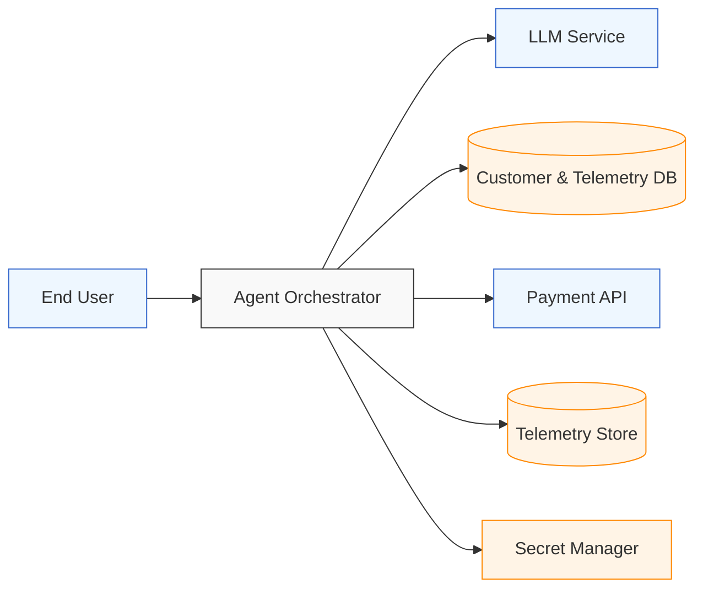

# STRIDE Template – AgentBank Architecture

This template provides the architecture diagram and STRIDE threat categories you will use to complete your threat‑modeling activity.

---

## Architecture Diagram

---

## STRIDE Threat Table

Use this table to identify potential threats for each component in the architecture.

| Component            | STRIDE Category          | Example Threat                                                                 | Mitigation                                                                 |
|----------------------|--------------------------|---------------------------------------------------------------------------------|----------------------------------------------------------------------------|
| Agent Orchestrator   | Tampering                | Prompt injection alters tool‑call instructions                                  | Schema validation, guardrails, allowlisted tools                           |
| LLM Service          | Information Disclosure   | Model leaks API keys or PII in responses                                       | Redaction, prompt hygiene, secret isolation                                |
| Customer DB          | Elevation of Privilege   | Agent accesses tables beyond intended scope                                    | Row‑level security, IAM roles, least privilege                             |
| Telemetry Store      | Repudiation              | No audit trail for risky actions                                               | Immutable logs, timestamps, request IDs                                    |
| Payment API          | Spoofing                 | Attacker impersonates agent to trigger payments                                | Auth tokens, request signing, rate limiting                                |
| Secret Manager       | Information Disclosure   | Secrets exposed in logs or prompts                                             | Never log secrets, scoped access, strong IAM policies                      |

---

## Key Threat Focus Areas

These two categories are especially important for this system.  
Use them as guidance when completing your STRIDE analysis.

### **Tampering (Prompt Injection)**
- Occurs between User → Agent → LLM  
- Risk: Malicious instructions cause unauthorized tool calls  
- Controls: Guardrails, schema validation, allowlisted actions  

### **Information Disclosure (API Key Leakage)**
- Occurs in LLM responses or telemetry logs  
- Risk: Secrets or PII leak into logs or prompts  
- Controls: Secret Manager, redaction pipeline, strict logging policy  

---
